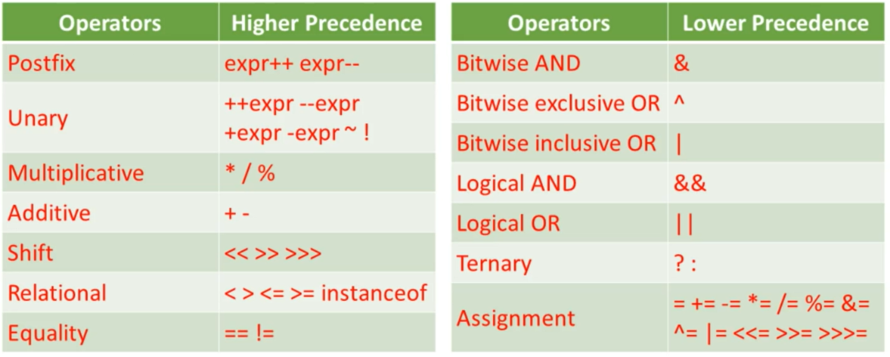

## Getting Started

Welcome to the VS Code Java world. Here is a guideline to help you get started to write Java code in Visual Studio Code.

## Folder Structure

The workspace contains two folders by default, where:

- `src`: the folder to maintain sources
- `lib`: the folder to maintain dependencies

Meanwhile, the compiled output files will be generated in the `bin` folder by default.

> If you want to customize the folder structure, open `.vscode/settings.json` and update the related settings there.

## Dependency Management

The `JAVA PROJECTS` view allows you to manage your dependencies. More details can be found [here](https://github.com/microsoft/vscode-java-dependency#manage-dependencies).

## DEFINITIONS LEARNED
- Java Virtual Machine(JVM) is responsible for the hardware- and operating system-independence of the Java SE platform, the small size of compiled code (bytecodes), and platform security.

## Section 1: JAVA Basics

## 1.1 Scope of Variables
Scope of a variable: Section of program where the variable is visible
    - scope of a variable is determined when at compile time(not run time)

TYPES:
- Class-level scope
    - Class-level variable 
        - ^ variables a.k.a. fields, are declared inside a class and not in any methods
        - Accessible from anywhere within the class, also maybe from outside depending on the modifier in place
            
- Method-Level Scope
    - method-level variable
        - declared inside our method, a.k.a. local variable. Visible to the method declarations, until the method returns. 
        - declared as part of the method signature and initialized when method is invoked
- Block-Level Scope
    - defined by a pair or curly brackers
    - Can only be accessed from its declaration until the end of the curly brackets, and is not accessible to code outside the curly bracket block
    *To know in Java: Variable declarations are bound to their scope, and you cannot redeclare a variable in the same scope.*
    
## 1.2 Structure of a Java Class
**Class Declaration**
- Modifiers
- the class keyword
- the class name
- If any, name of superclass
- If any, list of interfaces implemented by class, preceded by implements keyword 
- the class body, surrounded by { }
    

**Field Declaration**
- If any to specify, modifiers
- type of field
- name of field
- `int myField = 4;`

**Method Declaration**
- Modifiers
- the return type, or void if none
- the method name
- list of input parameters, preceded by their data type
- If any, an exception list
- the method body, surrounded by { }
- `void myMethod() {`
    `// do something`
    `}`

**Constructor Declaration**
Constructors are used to create objects from the class blueprint
- look like method declarations, except that they use the name of the class. and have no return type
    - Modifiers
    - list of input parameters, preceded by their data type
    - If any, an exception list
    - the constructor body

## 1.3 Main Method
Application Requirements:
- A class with a public scope modifier
- Must have a method in the format:
    - `public static void main(String...args) { // code goes here}`
    - `public static void main(String[] args) { // code goes here}`

*Identifiers in JAVA are case-sensitive*
- The javac compiler consumes source code and produces bytecode

## 1.4 Importing packages
- Import statements must be put at the beginning of a file, after package statement if any
- Example import:
    `import java.util.List`
    `import java.util.*`
- *There are no package hiercharies in java and all packages are independent*

## 1.5 Feautures and Components of the Java Programming Language
**Features of Java**
- Simple
- Object-Oriented
- Distributed
- Interpreted
- Secure
- Robust
- Architecture Neutral
- Platform Independent (portable)
- High Performace
- Multithreaded
- Dynamic

**Object Oriented Concepts**
- *Inheritance*: When a class uses the fields and methods of another class
- *Polymorphism*: Subclasses of a class can define their own behavior yet still share some functionality from their superclass
- *Abstraction*: Only showing essential features of an object, while hiding certain details 
- *Encapsulation*: Wrapping data and the code that operates and that data into a single entity

## Section 2: Working with Java DataTypes
## 2.1 Declaring and Initializing Variables
Initializing:
- Class-level variables: declared and initialized at the same time. If we declare without initializing, compiler will set the variable to a default value, depending on its datatype.
- Local variables: Must be explicitly initialized before being used, compiler will not do so.

**Primitive Data Type Casting**
- Widening casting: implicitly implemented, doesn't require cast operator
        - `byte -> short -> int -> long -> float -> double`
- Narrowing casting: explicitly implemented, requires cast operator
        - `double -> float -> long -> int -> short -> byte`
- Casting to and from *char*:
    - Widening casting: `char -> int | long | float | double`
    - Narrowing casting: `char -> byte | short`   
        `short | int | long | float | double -> char`
    - Widening and narrowing casting: `byte <-> char`
- *Primitive type casting never results in a runtime exception*

## 2.2 Object Reference vs Primitive Variables
**Object reference variables**
- Stores the memory addresses(reference) of objects that they refer to
- *always uses new(remember c++)

- Comparison:
    - Compared based on the address of their associated objects in memory(think pointers in c++)
    - `System.out.println(a == b)`;         // false → compares memory addresses
    - `System.out.println(a.equals(b))`;    // true  → compares actual content
- Assignment:
    - Adress is copied when assigning, LHS variable points to same object returned by expression on RHS
- Parameter Passing:
    - passed by the address of referenced object in memory
    - changes made are reflected in the argument
-Value Returning:
    - returned by address of referenced object in memory

**Primitive variables**
- Store actual values

- Comparison:
    - Compared based on literal values
- Assignment:
    - Value of RHS is copied to the LHS, with LHS variable holding its own value
- Parameter Passing
    - Passed in method by actual value
    - changes made to parameter are independent of passed-in argument
- Value Returning
    - returned from method by actual value
    - dies after execution

## 2.3 Read and Write Object Fields
- Statements within an object can access achd change a field of the object using the *this* keyword
- If field isn't shadowed by a local var, the *this* can be left out
- *this* ONLY refers to class variables(therefore overiding the local one)

## 2.4 Object's Lifecycle
**Object Creation**
- Instantiation
    - done with the *new* operator
    - new object is created ONLY when *new* operator is used
-  Initialization
    - implemented by constructors

**Object Destruction**
- Can be destroyed using dereference by reassignment, therefore elligible for garbage collection
- Object has to not have been reference
- Objectis created when new Myclass() is called
        
## 2.5 Code that Uses Wrapper Classes
8 Wrapper Classes are provided for primitive data types
- boolean
- Byte 
- Short
- Integer
- Long
- Float
- Double
- Character

## Section 3: Using Operators and Decision Constructs
## 3.1 Using Java Operators

- Evaluated from high -> low then left -> right but assignment is right -> left
- Operator precedence may be overriden using parentheses
- Example 1:
    - ` int integer1 = 1 + 2 * 3; `
    - ` int integer2 = (1 + 2) * 3; `
    - ` System.out.println(integer1);     // 7 `
    - ` System.out.println(integer2);     // 9 `
- Example 2:
    - ` boolean boolean1 = true || true && false; `
    - ` boolean boolean2 = (true || true) && false; `
    - ` System.out.println(boolean1);   //true `
    - ` System.out.println(boolean2);   //false `

## 3.2 Equality with Strings
**String Constant Pool**
- Area in heap memory containing string ojects
- Strings created using string literals are returned from the string constant pool. however, strings created using the new operator are created in heap memory and returned from outside the pool

**Comparison of Objects Using the == Operator**
- compares objects by reference
- only evaluates to true if the 2 objects are the same
    - `String string1 = new String("helllooo") `
    - `String string2 = "helllooo" `
    - `String string3 = "helllooo" `
    - `System.out.println(string1 == string2);       //false `
    - `System.out.println(string2 == string3);       //true `

**Comparison of Objects Using the equals method**
- defined in the object class
- compares objects based on how it is overriden in the blueperint classes, compares the same as == if not overriden

**Comparison of Strings Using the equals method**
- equals method is overriden in the String class, and compares strings based on their literal values
    - `String string1 = new String("helllooo"); `
    - `String string2 = new String("helllooo"); `
    - `String string3 = "helllooo"; `
    - `System.out.println(string1.equals(string2));       //true `
    - `System.out.println(string2.equals(string3));       //true `

## 3.3 Creating if & If elses
- The if-then construct tells our program to execute a certain section only if a particular test is true
- The if-then provides a secondary path of execution for the if-then when the if clause if false
- ternary operator: condition ? value1 : value2
    - `int i = 5 `
    - `String output = i > 0 ? "Positive" : "Not positive"; `
    - `System.out.println(output); `

## 3.4 Using switch
- Switch statement can have many possible execution paths
- works with bytes, short, char, int data types and their wrapper classes. also enum types and String
- doesn't accept booleans
    - `String s = "Helohi"; `
    - `switch(s) { `
    - `case "Helohi": `
    -   `System.out.println("hey"); `
    -   `System.out.println("hey"); `
    - `default: `
    -   `System.out.println("Java"); `

## Section 4: Creating and Using Arrays
## 4.1 One-dimensional arrays
**Declaration**
- Array Type
    - `int[]   String[]   MyObject[] ` 
- Array Name
    - `intArray  stringArray  objectArray`
- `int[] intArray; `

**Instantiation**
- can be instantiated with the new operator
- followed by the type of elements
- and array length enclosed in square brackets
- `intArray = new int[5]; `

**Initialization**
- initialized with default values when the array is created
- *index starts at 0*  default is null, 0s, and false...

Arrays can also be instantiatied and initialized using an array initializer
- `intArray = {1, 2, 3, 4, 5}; `
- `intArray = new int[] {1, 2, 3, 4, 5}; `  

## 4.2 Multi-dimensional arrays
**Declaration**
- Array Type, with multiple pairs of brackets
    - `int[]   String[][]    MyObject[][] ` 
- Array Name
    - `intArray  stringArray  objectArray`
- `String[][][] stringArray;`

**Instantiation**
- can be instantiated with the new operator
- followed by the type of elements
- and 2 or more pairs of square brackets, each representing a dimention
- `intArray = new int[4][6]; `     *first bracket must contain a length

**Initialization**
- can be initialized by assigning values to its elements at all levels(nested for loops)

Multi-dimensional Arrays can also be instantiatied and initialized using an array initializer
- `int[][] intArray = {{1, 2}, {3, 4, 5}}; `
- `int[][] intArray = new int[][] {{1, 2}, {3, 4, 5}}; `

## Section 5: Using Loop Constructs

## 5.1: Create and Use While Loops
While statement is a construct that continually executes a block of statements while a particular condition evaluates to true
- `int i = 0; `
- `while (i < 10) { `
-    `System.out.println(i); `
-    `i++; `
- `}`
*while must evaluate to a boolean value*

## 5.2: Create and Use for loops
For loop is a compact way to iterate over a range of values until a particular condition is satisfied
- `for (initialization; termination; increment/decrement) { `
-    `statement(s); `
- `}`

- `for (int i = 0; i < 10; i++) { `
-  ` System.out.println(i); `
- `}`

**The Enhanced For Loop**
A form of the for construct designed for iteration through collections and arrays
- `for (type element : collection/array) {`
-  ` statement(s); `
- `}`

- `int[] intArray = {0, 1, 2, 3, 4, 5, 6, 7, 8, 9 }; `
- `for (int element : intArray) {`
-   `System.out.println(element); `
- `}`

## 5.3
