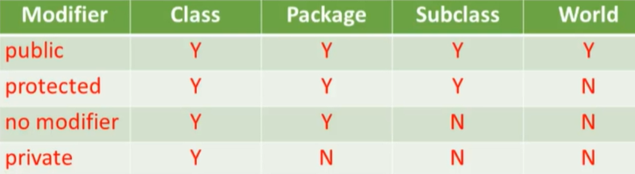

## Section 1: JAVA Basics

## 1.1 Scope of Variables
Scope of a variable: Section of program where the variable is visible
    - scope of a variable is determined when at compile time(not run time)

TYPES:
- Class-level scope
    - Class-level variable 
        - ^ variables a.k.a. fields, are declared inside a class and not in any methods
        - Accessible from anywhere within the class, also maybe from outside depending on the modifier in place
            
- Method-Level Scope
    - method-level variable
        - declared inside our method, a.k.a. local variable. Visible to the method declarations, until the method returns. 
        - declared as part of the method signature and initialized when method is invoked
- Block-Level Scope
    - defined by a pair or curly brackers
    - Can only be accessed from its declaration until the end of the curly brackets, and is not accessible to code outside the curly bracket block
    *To know in Java: Variable declarations are bound to their scope, and you cannot redeclare a variable in the same scope.*
    
## 1.2 Structure of a Java Class
**Class Declaration**
- Modifiers
- the class keyword
- the class name
- If any, name of superclass
- If any, list of interfaces implemented by class, preceded by implements keyword 
- the class body, surrounded by { }
    

**Field Declaration**
- If any to specify, modifiers
- type of field
- name of field
- `int myField = 4;`

**Method Declaration**
- Modifiers
- the return type, or void if none
- the method name
- list of input parameters, preceded by their data type
- If any, an exception list
- the method body, surrounded by { }
- `void myMethod() {`
    `// do something`
    `}`

**Constructor Declaration**
Constructors are used to create objects from the class blueprint
- look like method declarations, except that they use the name of the class. and have no return type
    - Modifiers
    - list of input parameters, preceded by their data type
    - If any, an exception list
    - the constructor body

## 1.3 Main Method
Application Requirements:
- A class with a public scope modifier
- Must have a method in the format:
    - `public static void main(String...args) { // code goes here}`
    - `public static void main(String[] args) { // code goes here}`

*Identifiers in JAVA are case-sensitive*
- The javac compiler consumes source code and produces bytecode

## 1.4 Importing packages
- Import statements must be put at the beginning of a file, after package statement if any
- Example import:
    `import java.util.List`
    `import java.util.*`
- *There are no package hiercharies in java and all packages are independent*

## 1.5 Feautures and Components of the Java Programming Language
**Features of Java**
- Simple
- Object-Oriented
- Distributed
- Interpreted
- Secure
- Robust
- Architecture Neutral
- Platform Independent (portable)
- High Performace
- Multithreaded
- Dynamic

**Object Oriented Concepts**
- *Inheritance*: When a class uses the fields and methods of another class
- *Polymorphism*: Subclasses of a class can define their own behavior yet still share some functionality from their superclass
- *Abstraction*: Only showing essential features of an object, while hiding certain details 
- *Encapsulation*: Wrapping data and the code that operates and that data into a single entity