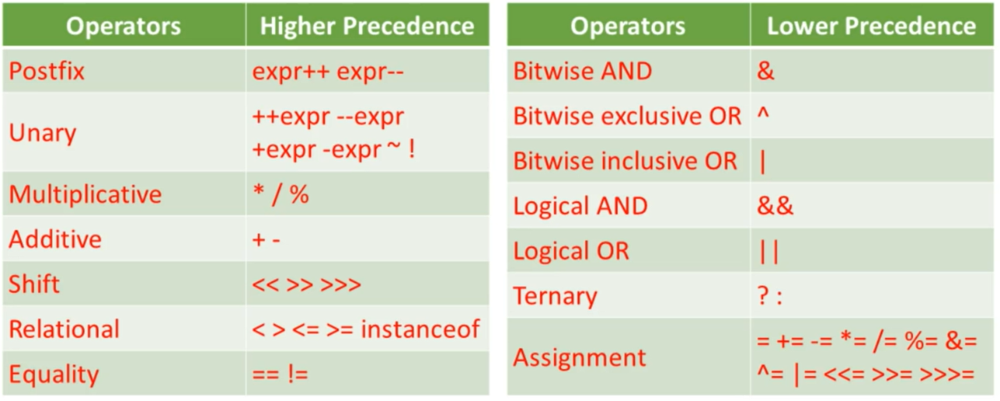

## Section 3: Using Operators and Decision Constructs
## 3.1 Using Java Operators

- Evaluated from high -> low then left -> right but assignment is right -> left
- Operator precedence may be overriden using parentheses
- Example 1:
    - ` int integer1 = 1 + 2 * 3; `
    - ` int integer2 = (1 + 2) * 3; `
    - ` System.out.println(integer1);     // 7 `
    - ` System.out.println(integer2);     // 9 `
- Example 2:
    - ` boolean boolean1 = true || true && false; `
    - ` boolean boolean2 = (true || true) && false; `
    - ` System.out.println(boolean1);   //true `
    - ` System.out.println(boolean2);   //false `

## 3.2 Equality with Strings
**String Constant Pool**
- Area in heap memory containing string ojects
- Strings created using string literals are returned from the string constant pool. however, strings created using the new operator are created in heap memory and returned from outside the pool

**Comparison of Objects Using the == Operator**
- compares objects by reference
- only evaluates to true if the 2 objects are the same
    - `String string1 = new String("helllooo") `
    - `String string2 = "helllooo" `
    - `String string3 = "helllooo" `
    - `System.out.println(string1 == string2);       //false `
    - `System.out.println(string2 == string3);       //true `


**Comparison of Objects Using the equals method**
- defined in the object class
- compares objects based on how it is overriden in the blueperint classes, compares the same as == if not overriden

**Comparison of Strings Using the equals method**
- equals method is overriden in the String class, and compares strings based on their literal values
    - `String string1 = new String("helllooo"); `
    - `String string2 = new String("helllooo"); `
    - `String string3 = "helllooo"; `
    - `System.out.println(string1.equals(string2));       //true `
    - `System.out.println(string2.equals(string3));       //true `


## 3.3 Creating if & If elses
- The if-then construct tells our program to execute a certain section only if a particular test is true
- The if-then provides a secondary path of execution for the if-then when the if clause if false
- ternary operator: condition ? value1 : value2
    - `int i = 5 `
    - `String output = i > 0 ? "Positive" : "Not positive"; `
    - `System.out.println(output); `

## 3.4 Using switch
- Switch statement can have many possible execution paths
- works with bytes, short, char, int data types and their wrapper classes. also enum types and String
- doesn't accept booleans
```java
String s = "Helohi";
switch(s) {
    case "Helohi":
        System.out.println("hey");
    default: `
        System.out.println("Java"); 
}
```