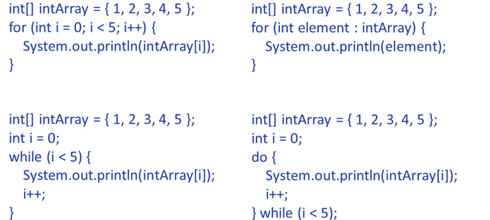

## Section 5: Using Loop Constructs

## 5.1 Create and Use While Loops
While statement is a construct that continually executes a block of statements while a particular condition evaluates to true
*while must evaluate to a boolean value*
```java
int i = 0;
while (i < 10) {
    System.out.println(i);
    i++;
}
```

## 5.2 Create and Use for loops
For loop is a compact way to iterate over a range of values until a particular condition is satisfied
```java
for (initialization; termination; increment/decrement) {
    statement(s);
}
```
```java
for (int i = 0; i < 10; i++) {
    System.out.println(i);
}
```

**The Enhanced For Loop** aka For-Each Loop  
A form of the for construct designed for iteration through collections and arrays
```java
for (type element : collection/array) {
    statement(s); `
}
```
```java
int[] intArray = {0, 1, 2, 3, 4, 5, 6, 7, 8, 9 }; 
for (int element : intArray) {
    System.out.println(element);
}
```
## 5.3 Create and Use Do/While Loops
The do-while statement continually executes a block of statements while a particular condition evaluates to true
*body always runs at least once, even if the condition is false, because the condition is checked after the body*

```java
do {
    statement(s);
} while(condition); 
```
```java
int i = 0; 
do {
    System.out.println(i);
    i++; 
} while (i < 10); 
```
## 5.4 Comparing Loop Constructs
- For statement has 2 forms; one is designed for looping through collections and arrays
- While evaluates condition at the top of the loop, do-while evaluates at the bottom. do-whiles are always executed atleast once
- increment/decrement has to be specified as part of execution block for while n do-while; it is a seperate expression for for loops

[Go to Loops](src/loops.java)

## 5.5 Using Break and Continue
**Break Statement**  
Break statement instructs the program to terminate an enclosing switch or loop construct
- unlabled 
    - breaks the innermost enclosing construct
- labeled
    - may break the outer enclosing construct      
[Go to BreakPractice](src/BreakPractice.java)

**Continue Statement**  
Instruct program to skip current iteration of an enclosing loop construct
- Does not work with switch construct
- unlabled 
    - breaks the innermost enclosing construct
- labeled
    - may break the outer enclosing construct   
[Go to ContinuePractice](src/ContinuePractice.java)
